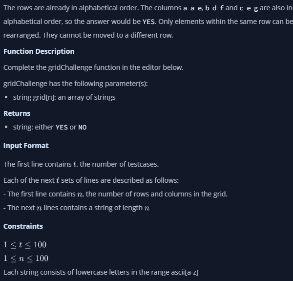
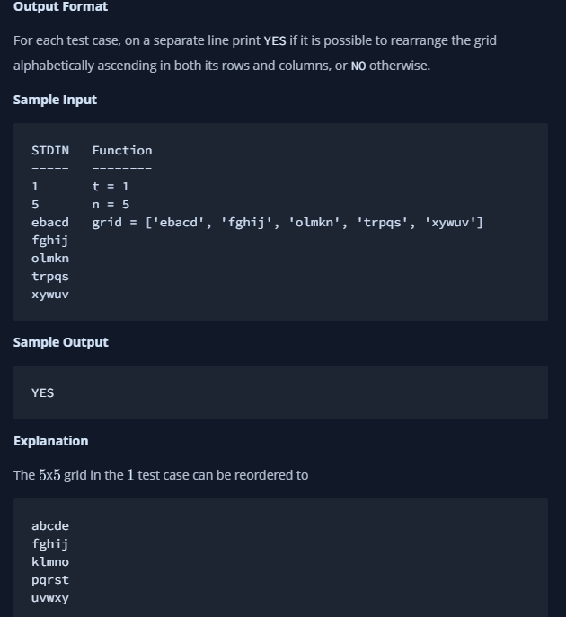

- [Hackerrank link](https://www.hackerrank.com/challenges/one-week-preparation-kit-grid-challenge/problem?isFullScreen=true&h_l=interview&playlist_slugs%5B%5D=preparation-kits&playlist_slugs%5B%5D=one-week-preparation-kit&playlist_slugs%5B%5D=one-week-day-four)
### Given a square grid of characters in the range ascii[a-z], rearrange elements of each row alphabetically, ascending. Determine if the columns are also in ascending alphabetical order, top to bottom. Return YES if they are or NO if they are not.
Example
```grid = ['abc','ade','efg']```
The grid is illustrated below.
```
a b c
a d e
e f g
```




